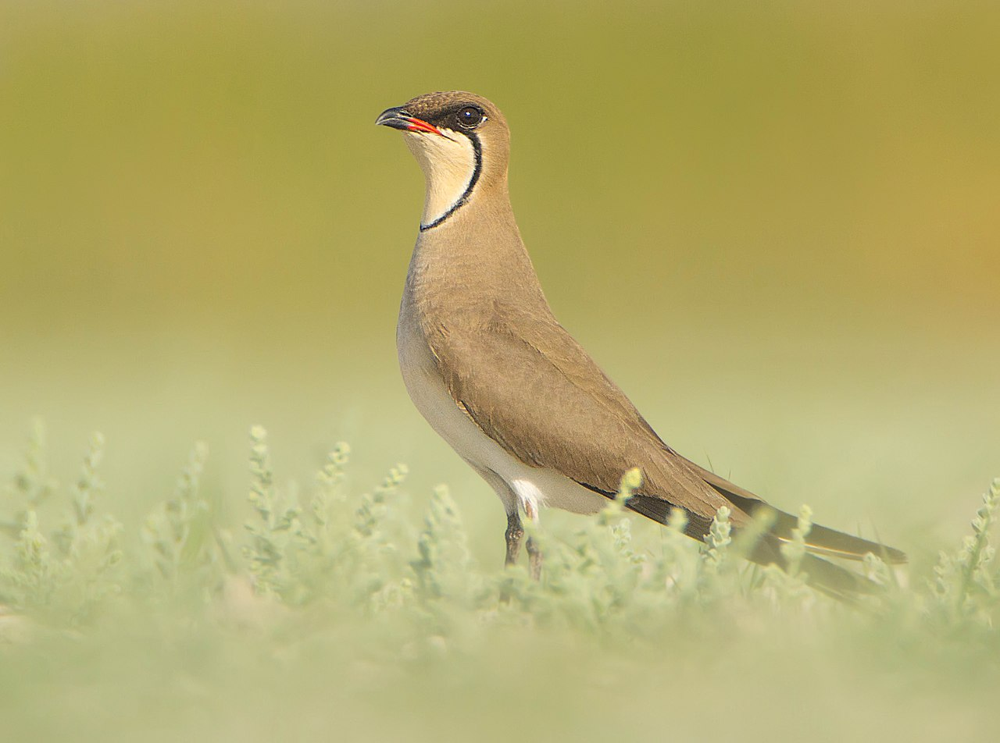

# Glareola

Collared pratincole (Glareola pratincola) by Saswat Mishra
[CC-BY-SA-4.0](https://commons.wikimedia.org/wiki/Category:CC-BY-SA-4.0)

## Description

Glareola is a simple react native application to collect rarity bird
observation data from web, focusing on Hungary and the nearby countries.
Currently, it is under development and only crawling data from 
[birding.hu](http://www.birding.hu).

## TODO

- [ ] Create adjustable filter by species
- [ ] Create alerts
- [ ] Design improvements
- [ ] Deploy and build with CI/CD (GitHub Actions)
- [ ] Add more data sources (rarebirds.hu, birding.sk, etc.)
- [ ] Calculate distance by the device's location
